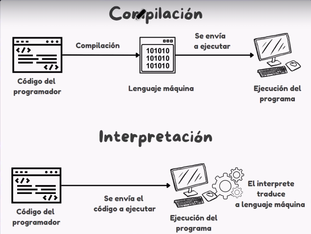

## Lenguajes de progrmación

### Compilado
- Traducido al lenguaje de la maquina,el compilador traduce el lenguaje de progrmación al lenguaje maquina (C,C++,GO,Rust)
### Interpretado
- Escribimos el codigo y el interprete traduce a lenguaje maquina(PHP,JS,Python)